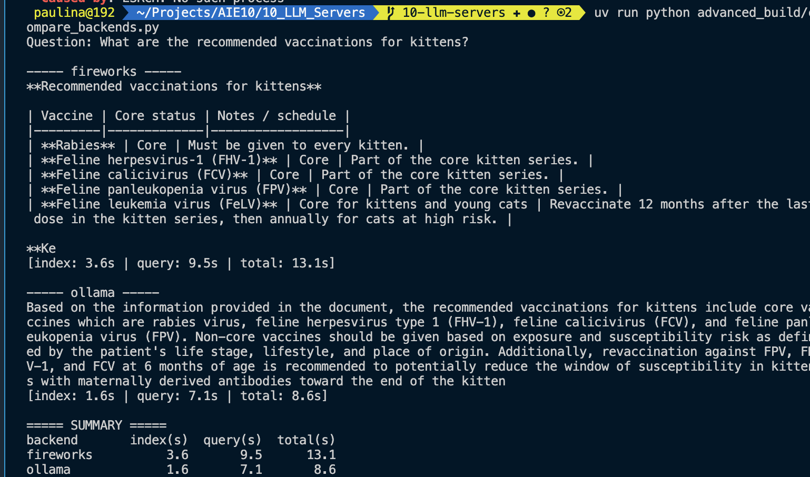
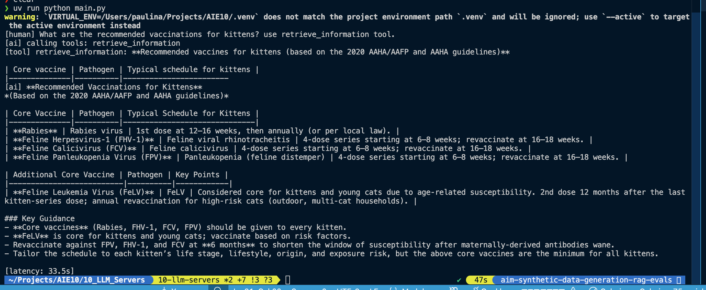
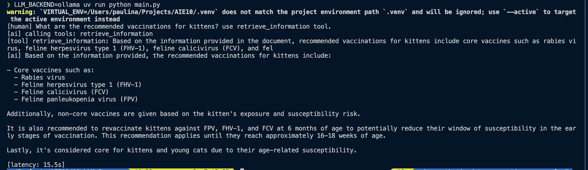
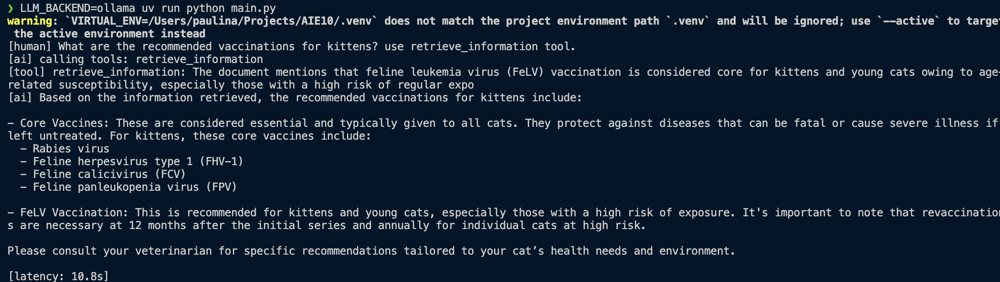

# Advanced Build: Local Models (runbook)

Swap the hosted Fireworks endpoints for locally-running open-source models and
rebuild the RAG on top of them. There is no separate code path. The main app
picks the backend from the `LLM_BACKEND` flag, so you start the same app with a
flag instead of maintaining a second RAG.

- `LLM_BACKEND=fireworks` (default) — hosted Fireworks AI
- `LLM_BACKEND=ollama` — fully local: chat and embeddings both served by Ollama

The switch lives in [`app/models.py`](../app/models.py) (`get_chat_model` and
`get_embeddings`), which [`app/rag.py`](../app/rag.py) and the graphs already use.

## 1. Install Ollama

```bash
brew install ollama      # or download the app from https://ollama.com
ollama serve             # starts the local server on :11434 (the app does this too)
```

## 2. Pull the local models

```bash
ollama pull qwen2.5:3b          # chat / generation (supports tool calling)
ollama pull nomic-embed-text    # embeddings
```

> `qwen2.5:3b` is a small, fast Qwen that handles the agent's tool calls. Bump to
> `qwen2.5:7b` for better answer quality, or drop to `qwen2.5:1.5b` for speed, by
> setting `OLLAMA_CHAT_MODEL`.

## 3. Run the app with the local flag

Point the app at Ollama by setting the flag on startup:

```bash
cd 10_LLM_Servers

# One-shot RAG run:
LLM_BACKEND=ollama uv run python main.py

# ...or the LangGraph dev server + Studio:
LLM_BACKEND=ollama uv run langgraph dev
```

Without the flag the same commands run against Fireworks, so you can A/B the two
backends by only changing `LLM_BACKEND`.

## 4. Compare (Results)

Run the same question on each backend and note the difference. Run the app once
per backend and compare the two runs (and their LangSmith traces):

```bash
uv run python main.py                     # Fireworks (hosted)
LLM_BACKEND=ollama uv run python main.py  # local Ollama
```




- Quality: is the local answer as grounded and complete as the Fireworks one?
- Latency: time the full response on each.

Fireworks output data:


Total latency: 33.5s
Total tokens: 7,969 (6,475 input + 1,494 output)
Total cost:  $0.0009

Local Ollama output data:

but on 2nd run because it was warm already it was faster:

Total latency: 15.5s cold start | 10 sec warm
Cost: 0$

### Insights (local vs managed in production)

Cost. Local is effectively free per query once the hardware is paid for, while
Fireworks bills per token. That flips the economics at scale: a few dev queries
are pennies on Fireworks, but steady production traffic is where a local or
self-hosted option starts to pay off.

Cold start is real. The very first local request pays to load the model into
memory (we saw a run jump from ~7s warm to ~18s cold). Hosted endpoints keep the
model warm for you, so you never see that penalty. If you run local, keep the
model resident or accept a slow first request.

Privacy and control. With local, the document text and the questions never leave
the machine, which matters for sensitive data. Nothing depends on a vendor
account either, no rate limits, and no surprise suspension (we hit exactly that
when the Fireworks credits ran out).

Model size is the real quality lever. The laptop can comfortably run a 3B model;
Fireworks runs a 20B on datacenter GPUs. That gap is why the hosted answer was
richer. Local quality is capped by what fits in your RAM/VRAM.

Scaling under load. This test was a single request. A laptop serves roughly one
generation at a time, while a hosted endpoint scales horizontally for many
concurrent users. For a single user local is great; for real traffic the hosted
path holds up far better.

Where each fits. Local suits development, privacy-sensitive workloads, offline
use, and predictable cost. Managed suits production traffic, larger/higher
quality models, and bursty concurrency where you do not want to run the
infrastructure yourself.
